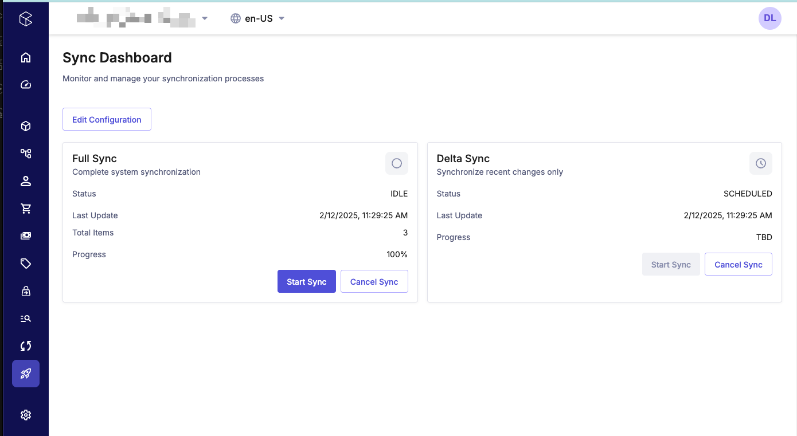
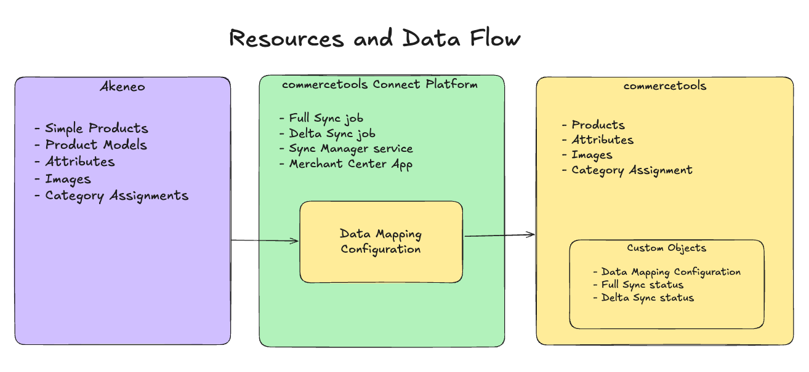
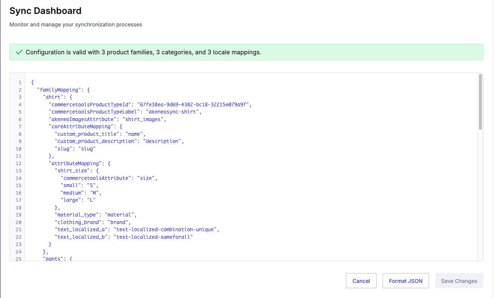
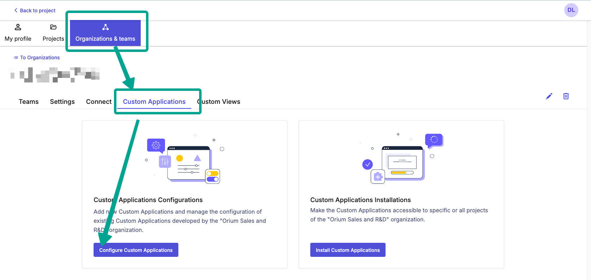
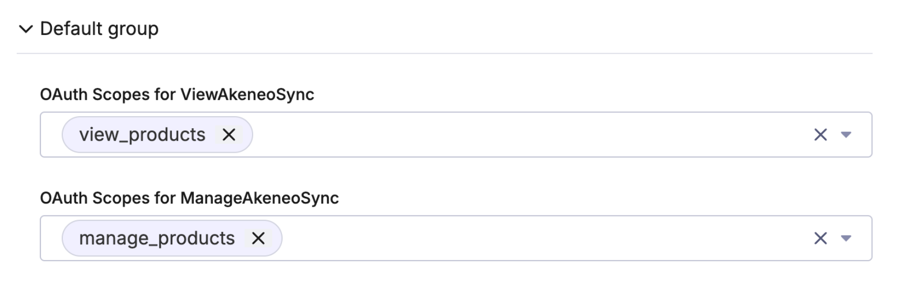

# CT Connect: Sync product data in Akeneo to commercetools

This commercetools Connector enables the one-way synchronization of product data from Akeneo PIM to commercetools.

This repository is intended to serve as a foundational starting point for teams looking to build a custom Akeneo to commercetools synchronization solution on the commercetools Connect platform. This is not a one-size-fits-all solution, and teams should review and modify the code to meet their specific requirements.

This README provides step-by-step instructions on configuring and deploying the Akeneo Connector, helping developers quickly implement the solution for real-world use cases, minimizing manual data entry, and ensuring up-to-date product information.



## Table of Contents

- [Overview](#overview)
  - [What is included?](#what-is-included)
- [Prerequisites](#prerequisites)
  - [API Credentials](#api-credentials)
  - [commercetools Product Type configuration](#commercetools-product-type-configuration)
- [Data Mapping Configuration](#data-mapping-configuration)
  - [Types](#types)
    - [The `Config` Type](#the-config-type)
    - [The `FamilyConfig` Type](#the-familyconfig-type)
  - [Supported Akeneo attribute types](#supported-akeneo-attribute-types)
  - [Example Data Mapping](#example-data-mapping)
- [Environment Variable Configuration](#environment-variable-configuration)
  - [commercetools](#commercetools)
  - [Akeneo](#akeneo)
  - [Publishing Control](#publishing-control)
- [Use of Custom Objects](#use-of-custom-objects)
- [Architecture](#architecture)
  - [The FullSync job](#the-fullsync-job)
  - [The DeltaSync job](#the-deltasync-job)
  - [The SyncManager Service](#the-syncmanager-service)
  - [The Akeneo Sync Merchant Center App](#the-akeneo-sync-merchant-center-app)
- [Synchronization Logic](#synchronization-logic)
  - [Querying Akeneo](#querying-akeneo)
  - [Synchronizing to commercetools](#synchronizing-to-commercetools)
    - [Syncing Products](#syncing-products)
    - [Syncing Product Models](#syncing-product-models)
- [State Machines](#state-machines)
  - [Overview of the akeneoMachine](#overview-of-akeneomachine)
  - [`akeneoMachine` States](#akeneomachine-states)
- [Deployment to commercetools Connect](#deployment)
- [Uninstalling the Connector](#uninstalling-the-connector)
- [Logging](#logging)
- [Security](#security)
- [Data Syncing Scenarios](#data-syncing-scenarios)
- [FAQ](#faq)
- [Assumptions and Limitations](#assumptions-and-limitations)

## Overview

This Connector allows teams to execute synchronization jobs that query Akeneo product data and synchronize it into commercetools. The Akeneo data is upserted into commercetools - creating new products and variants when needed, or, updating existing records that exist from a prior synchronization job.

- The connector supports synchronizing Akeneo Product data of: Attributes, Images, and Category Assignment.
- The connector uses the Akeneo REST API and the commercetools REST API.

The Connector contains two `jobs` (see [Connect applications](https://docs.commercetools.com/connect/overview#connect-applications)) that provide data syncing from Akeneo to commercetools:

- Full Sync: This job will sync all product records to commercetools.
- Delta Sync: This job will sync recent product updates to commercetools.

The behavior of which Akeneo products to sync, and how their data maps into commercetools, is configured via a JSON [Data Mapping](#data-mapping-configuration) object. This mapping configuration is managed in the Merchant Center, allowing teams to easily adjust and fine tune which products and attributes are being synced.

A commercetools [Merchant Center App](#the-akeneo-sync-merchant-center-app) is included in this repository, providing a dashboard view of the Full Sync and Delta Sync jobs allowing teams to easily view the status of recent synchronizations. This app also allows users to modify the Data Mapping configuration object that managed which product families and attributes are synced to commercetools.



### What is included?

This Connector includes the following Connect applications for deployment to the commercetools Connect platform:

- **FullSync**
  - A `job` that will sync all time product data from Akeneo to commercetools.
- **DeltaSync**
  - A `job` that will sync recently product changes from Akeneo to commercetools.
- **SyncManager**
  - A `service` that is used by the Merchant Center App to manage the FullSync and DeltaSync jobs.
- **MerchantCenterAkeneoSyncApp**
  - A `merchant-center-custom-application` that provides:
    - A dashboard view of the Full Sync and Delta Sync jobs.
    - Enabled users to start and stop the sync jobs.
    - View recent sync errors.
    - Modify the [Data Mapping](#data-mapping-configuration) configuration.

## Prerequisites

In order to use the Akeneo to commercetools Connector:

- API credentials must be obtained in order to access the Akeneo and commercetools APIs.
- The commercetools Product Types defined in the Data Mapping file must be updated with two new attributes.

### API Credentials

Follow the below steps to setup a new Akeneo **Connection** and a new commercetools **API Client** and save the API credentials in a secure location.

#### Akeneo Connection Setup

This section will guide you through configuring a new Connection in Akeneo with the correct API permissions required for the Akeneo to commercetools sync.

1 - Create a new **Role** called "Commercetools Connector":

- In the Permissions tab, ensure there are no permissions applied (everything should be unchecked)
- In the **Web API Permissions** tab, apply the following:

  - [x] **Overall Web API**
  - **Assets**
    - [x] List assets
    - [x] List asset families
  - **Products**
    - [x] List products

2 - Create a new **Group** called "Commercetools Connector".
3 - Create a new **Connection**:

- Click Connect => Connection settings
- Click Create. Use "Commercetools Connector" for the Label and Code. Set the Flow type to "Data destination".
- Save the Client ID, Secret, Username, and Password in a secure location for later use.
- In the Permissions Section, assign the **Role** and **Group** created in steps 1 and 2.

#### commercetools API Client Setup

Create an API client in commercetools:

- Give it a name of "Akeneo Connector"
- Assign the manage products scope.
- Click Create API client
- Save the API credentials in a secure location for later use.

### commercetools Product Type configuration

The synchronization requires two attributes to be created on each commercetools Product Type defined in the Data Mapping configuration. These attributes are used to store a reference to the source product information in Akeneo.

Add the following attributes to each mapped Product Type:

- Parent Code
  - Name: `akeneo_parent_code`
  - Label: Akeneo Parent Code
  - Constraint: Same for all
  - Attribute Type: Text
  - Attribute Settings: Searchable
- Akeneo Id
  - Name: `akeneo_id`
  - Label: Akeneo Id
  - Constraint: Unique
  - Attribute Type: Text
  - Attribute Settings: Searchable

## Data Mapping Configuration

This section covers how to setup the required Data Mapping configuration, instructing the connector which Akeneo Product Families to sync, and how their attributes are mapped into commercetools.

The Data Mapping configuration is stored in a Custom Object on the commercetools API. See the [SyncConfig](#syncconfig-custom-object) Custom Object.

To edit the the Data Mapping configuration, click on the **Edit Configuration** button in the Akeneo Sync Merchant Center App.

When editing the Data Mapping configuration, the app will validate the configuration in real time and when saving to ensure the configuration is valid.

The below sections cover the Typing system used to define the Data Mapping configuration. These types are meant to bootstrap the configuration object for a team using this connector and should be extended and modified as necessary to meet your data syncing requirements.



### Types

The Types in `job/src/types/config.types.ts` are used to manage the mapping configuration of Akeneo product families and their associated data to commercetools, ensuring product data from Akeneo is correctly transformed and aligned with the data structure expected by commercetools.

#### The `Config` Type

The `Config` type is composed of several key properties:

- `familyMapping`: This is a key-value dictionary where each key represents a product family code in Akeneo, and each value is a `FamilyConfig` object that specifies the mapping configuration for that family. Only the families specified in this mapping will be synced to commercetools.
- `localeMapping`: This object maps Akeneo locales to commercetools locales, where each key is the Akeneo locale, and each value is the target commercetools locale to map to. This mapping should populate all available locales in commercetools, otherwise localized values in commercetools will be null.
- `categoryMapping`: A mapping of Akeneo categories to commercetools categories. The key is the Akeneo category code, and commercetoolsCategoryId is the commercetools category ID. A human-readable label can be provided to help identify the commercetools category when maintaining the mapping configuration.
- `akeneoScope`: This string defines Akeneo channel to be synchronized, such as "ecommerce".

#### The `FamilyConfig` Type

The `FamilyConfig` type defines the mapping for each Akeneo Product Family. It includes:

- `commercetoolsProductTypeId`: The ID of the commercetools product type to map an Akeneo family to.
- `commercetoolsProductTypeLabel`: An optional human-readable label can be defined to help identify the commercetools product type when maintaining the mapping configuration.
- `akeneoImagesAttribute`: The Akeneo attribute that contains images for the products in this family. Images stored in this field will be uploaded to commercetools and applied to commercetools product variant records. For Product Models, the image attribute sholud be setup as a Variant Attribute (ie, not a "Common" attribute in Akeneo).
- `akeneoSkuField:`: An optional field that specifies the Akeneo attribute code that contains the SKU. By default, the SKU will be pulled from the `identifier` field from the Akeneo product record data.
- `coreAttributeMapping`: The mapping configuration of common top level product fields from Akeneo to commercetools, mapping to commercetools fields of: name, description, slug, and sku. The key is the Akeneo attribute code, and the value is the commercetools attribute name.
- `attributeMapping`: The mapping configuration of Akeneo attributes to commercetools attributes.
  - For Akeneo attribute types of `Yes/No`, `Number`, and `Text`: The key is the Akeneo attribute code, and the value is the commercetools attribute name.
  - For Akeneo attribute type of `Simple Select`: The key is the Akeneo attribute code, and the value is an object of `ListMapping`, where the commercetools attribute name is specified (the attribute **must** be of type _List (enum)_), and a key-value dictionary maps each Akeneo Option code to a corresponding commercetools enumeration key. See the [example data mapping](#example-data-mapping) sample for a reference.

### Supported Akeneo attribute types

The following Akeneo attribute types are supported for syncing to commercetools:

- **Yes/No**
  - Maps to the **Boolean** attribute type in commercetools
  - Important: The sync only supports **non** localized Yes/No attributes from Akeneo.
- **Number**
  - Maps to the **Number** attribute type in commercetools
  - Important: The sync only supports **non** localized Number attributes from Akeneo.
- **Text**
  - Maps to the **Text** attribute type in commercetools
  - Important: If the Akeneo attribute is localized, ensure the commercetools attribute is also localized.
- **Simple Select**
  - Maps to the **List (enum)** attribute type in commercetools.
  - Important:
    - Important: The sync only supports **non** localized Simple Select attributes from Akeneo.
    - The sync logic assumes the Akeneo option codes and commercetools enumeration keys are aligned. If desired, an explicit mapping can be defined for certain option codes to map them to their commercetools enumeration key. This is only needed if the code and enumeration key are different between each system.
- Images
  - **Image** and **Asset Collection** attributes are synced to commercetools variant images.
  - Important
    - The sync only supports **non** localized Image and Asset Collection attributes from Akeneo.
    - For Product Models, the Image attribute **must** be setup as a Variant Attribute.

### Example Data Mapping

This is an example Data Mapping configuration object that maps two Akeneo Product Families to commercetools.

- Each `familyMapping` object defines the commercetools product type id to map to in the `commercetoolsProductTypeId` field, and provides a human-readable label of the product type in the `commercetoolsProductTypeLabel` field.
  - The mapping for the `pants` family contains an optional override for the SKU field by specifying a value in the `akeneoSkuField` field, instructing the sync to use the `custom_sku_field` attribute as the SKU when syncing to commercetools. By default, the sync will use the `identifier` attribute of each product record when syncing SKU to commercetools.
- The `coreAttributeMapping` and `attributeMapping` define the attribute mapping between each system. The size attribute mapping for both the shirt and pant families map an Akeneo _Simple Select_ attribute to a _List (enum)_ commercetools attribute.
- The image field for the family is defined in `akeneoImagesAttribute`. Images stored in this field will be uploaded to commercetools and applied to commercetools product variant records.
- The `categoryMapping` mapping defines the mapping for two categories. A human readable label is provided to assist the maintainer of the mapping configuration.
- The `localeMapping` mapping defines the mapping of the desired locales to map.

The below code shows the mapping defined in a .ts file to showcase the typing system supporting a mapping configuration. When using this connector, you will only need to save the JSON object itself, without the typescript Types.

```ts
const config: Config = {
  familyMapping: {
    shirt: {
      commercetoolsProductTypeId: "67fe38ea-9d69-4382-bc18-32215e079a9f",
      commercetoolsProductTypeLabel: "shirt",
      akeneoImagesAttribute: "shirt_images",
      coreAttributeMapping: {
        custom_product_title: "name",
        custom_product_description: "description",
        slug: "slug",
      },
      attributeMapping: {
        shirt_size: {
          commercetoolsAttribute: "size",
          small: "S",
          medium: "M",
          large: "L",
        },
        material_type: "material",
        clothing_brand: "brand",
      },
    },
    pants: {
      commercetoolsProductTypeId: "ea924170-d0f5-45cb-a1d9-15282b4177a9",
      commercetoolsProductTypeLabel: "pants",
      akeneoSkuField: "custom_sku_field",
      akeneoImagesAttribute: "pant_images",
      coreAttributeMapping: {
        custom_product_title: "name",
        custom_product_description: "description",
        slug: "slug",
      },
      attributeMapping: {
        pant_size: {
          commercetoolsAttribute: "size",
          small: "S",
          medium: "M",
          large: "L",
        },
        material_type: "material",
        clothing_brand: "brand",
      },
    },
    tie: {
      commercetoolsProductTypeId: "9f26ab5b-d7f7-4d3e-b0bf-e4fa4f2651cf",
      commercetoolsProductTypeLabel: "tie",
      akeneoImagesAttribute: "tie_images",
      coreAttributeMapping: {
        custom_product_title: "name",
        custom_product_description: "description",
        slug: "slug",
      },
      attributeMapping: {
        material_type: "material",
        clothing_brand: "brand",
      },
    },
  },
  categoryMapping: {
    clothing: {
      commercetoolsCategoryid: "60fc5c02-08b2-44b0-8d18-bd8e91634031",
      label: "clothing",
    },
    shirt: {
      commercetoolsCategoryid: "066d7124-45a2-4935-ad16-3ce3afd535e2",
      label: "tshirts",
    },
    tie: {
      commercetoolsCategoryid: "8f78c07e-50a1-4592-b0ab-3d2c6c795174",
      label: "ties",
    },
  },
  localeMapping: {
    en_US: "en-US",
    en_CA: "en-CA",
    fr_CA: "fr-CA",
  },
  akeneoScope: "ecommerce",
};
```

## Environment Variable Configuration

The `connect.yaml` file specifies the required environment variables. To obtain the necessary API credentials, see [Prerequisites - API Credentials](#api-credentials).

### commercetools

- `CTP_CLIENT_ID`
- `CTP_CLIENT_SECRET`
- `CTP_PROJECT_KEY`
- `CTP_SCOPE`
- `CTP_REGION`

### Akeneo

- `AKENEO_CLIENT_ID`
- `AKENEO_CLIENT_SECRET`
- `AKENEO_USERNAME`
- `AKENEO_PASSWORD`
- `AKENEO_BASE_URL` - Your Akeneo Cloud URL, ex `https://example.cloud.akeneo.com`

### Publishing Control

- `SET_PUBLISHED_TO_MODIFIED`:
  - If set to `true`, product records that are modified during the sync will have a Published Status of `Modified` after the sync. This will require a merchant center user to Publish the commercetools product before it is available on the Storefront.
  - If set to `false`, product records that are updated as the result of this sync and were previously in a `Published` state will be re-published. This will cause synced Akeneo data to be immediately available on the Storefront.
  - Default: `true`

See the below table for how `SET_PUBLISHED_TO_MODIFIED` will impact product statuses in commercetools.

| Status Before Sync | SET_PUBLISHED_TO_MODIFIED | Status After Sync |
| ------------------ | ------------------------- | ----------------- |
| PUBLISHED          | False                     | PUBLISHED         |
| PUBLISHED          | True                      | MODIFIED          |
| MODIFIED           | N/A                       | UNPUBLISHED       |
| MODIFIED           | N/A                       | MODIFIED          |

## Use of Custom Objects

This Connector relies on commercetools [Custom Objects](https://docs.commercetools.com/api/projects/custom-objects) to track the status and details of the Full Sync and Delta Sync jobs.

- The Custom Objects are created automatically upon deployment via a [postDeploy](https://docs.commercetools.com/connect/automation-scripts#postdeploy) script.
- When uninstalling this connector the Custom Objects are automatically deleted via a [preUndeploy](https://docs.commercetools.com/connect/automation-scripts#preundeploy) script.

When deploying this Connector two Custom Objects will be created in the container namespace of `ct-connect-akeneo`.

- The FullSync Custom Object
  - container: `ct-connect-akeneo`
  - key: `full-sync`
- The DeltaSync Custom Object
  - container: `ct-connect-akeneo`
  - key: `delta-sync`
- The SyncConfig Custom Object
  - container: `ct-connect-akeneo`
  - key: `sync-config`

### The FullSync and DeltaSync Custom Objects

The FullSync and DeltaSync Custom Objects contain the following fields:

- **status**: The current status of the sync job.
  - `RUNNING`: The job is currently executing and synchronizing data.
  - `SCHEDULED`: The job is currently scheduled to run at the next scheduled interval, as defined in `connect.yaml`.
  - `TO_STOP`: The job has been instructed to stop syncing data, either by a user in the Merchant center App, or, the job incurred 100 errors during a sync and is automatically stopping.
  - `STOPPED`: The job is disabled, and will need to be manually toggled to resume scheduling. Review any errors in the Merchant Center App before re-enabling the job.
  - `RESUMABLE`: Syncs that take longer than 30 minutes to complete will enter this state, and future jobs will resume where a prior sync job left off. This can happen if many product records are being synced within a single job, for example, the first execution of a FullSync.
- **lastCursor**: A link to the Akeneo API that will allow a job to resume a partially completed sync.
- **lastSyncDate**: Stores the last date of a sync.
- **remainingToSync**: Stores the remaining number of products to sync for a given job.
- **totalToSync**: Stores the total number of products being synced for a given job.
- **failedSyncs**: Stores the number of errors that occurred during a given sync job. If a job incurs 100 errors during a sync, the job will stop and no more data will be synced in the current job.

### SyncConfig Custom Object

The SyncConfig Custom Object stores the following information:

- The [Data Mapping](#data-mapping-configuration) configuration object
  - The FullSync and DeltaSync jobs will read this configuration when beginning a sync job.
- The URL of the deployed `SyncManager` service
  - This allows the Merchant Center App to communicate with the correct url when performing an action like stopping or starting a job.

### Architecture

This section covers how the jobs, services, Custom Objects, and the Merchant Center app work together to provide data synchronization. The business logic built into the sync ensures that there is only one instance of a FullSync or DeltaSync job executing at any given time, ensuring that data synchronization is handled sequentially and preventing concurrent execution of the same job type.

The Connector is designed to function within the maximum job time limits imposed by the commercetools Connect platform.

#### The FullSync job:

The FullSync job, by default, runs once every minute. This can be modified as needed in the `connect.yaml`.

- Every minute, a new FullSync job is spawned.
- If the job detects that an existing FullSync job is currently executing, the job will end and do nothing.
  - This ensures that only one FullSync job is running at a time.
- If the job detects that data synchronization should occur, it updates the FullSync Custom Object to indicate that a FullSync is occurring, and then begins syncing data.
- If the job completes syncing data within the Connect platform's 30-minute time limit, the Fullsync Custom Object is updated to reflect a completed state.
- If the job does not complete syncing data within the Connect platform's 30-minute time limit, the FullSync Custom Object is updated reflect there is data remaining to be synced upon the execution of the next scheduled FullSync job.
  - The next scheduled FullSync job will resume from the last cursor stored in the FullSync Custom Object to continue syncing data. This ensures that all data is eventually synced to commercetools.
- Any errors that occur during the sync are logged and stored in the FullSync Custom Object, up to a total of 100 errors. These errors are displayed in the Merchant Center app.

#### The DeltaSync job:

The DeltaSync job, by default, runs once every 5 minutes. This can be modified as needed in the `connect.yaml`.

- Every 5 minutes, a new DeltaSync job is spawned.
- If the job detects that an existing DeltaSync job is currently executing, the job will end and do nothing.
  - This ensures that only one DeltaSync job is running at a time.
- If the job detects that data synchronization should occur, it updates the DeltaSync Custom Object to indicate that a DeltaSync is occurring. The job will then query Akeneo for recently modified product data and begin syncing it to commercetools. The data queried during this job is within a 5 minute rolling time window.
- If the job completes syncing data within the Connect platform's 30-minute time limit, the DeltaSync Custom Object to reflect a completed state.
- If the job does not complete syncing data within the Connect platform's 30-minute time limit, the DeltaSync Custom Object is updated to reflect that there is data remaining to be synced upon the execution of the next scheduled DeltaSync job.
  - The next scheduled DeltaSync job will resume from the last cursor stored in the DeltaSync Custom Object to continue syncing data. This ensures that all data is eventually synced to commercetools.
- The DeltaSync job can be stopped, and upon restarting, the sync will query for data since the last sync date stored in the DeltaSync Custom Object.

### The SyncManager Service

This service manages the Custom Object related to the FullSync and DeltaSync jobs. This service is used by the [Akeneo Sync Merchant Center App](#the-akeneo-sync-merchant-center-app) and allows a user in the Merchant Center to start or stop the full sync and delta sync jobs.

This service also allows manging of the Data Mapping configuration via the Merchant Center App, and stores the configuration in the `sync-config` Custom Object.

#### The Akeneo Sync Merchant Center App

The Merchant Center app provides users in the commercetools Merchant Center with a dashboard view of the synchronization jobs. It has the following features:

- It provides the current status, last sync date, recent sync errors.
- Ability to toggle on and off the FullSync and DeltaSync jobs via the `Start Sync` and `Cancel Sync` buttons.
- View errors from the last executed or currently executing sync job.
- Modify the Data Mapping configuration object via the `Edit Configuration` button.
  - The configuration object is validated before saving, using type `Config`. See `common-connect/src/types/config.types.ts` for the type definition. This type can be expanded and modified as needed to suite your Akeneo sync data requirements.


## Deployment

This section covers deployment of the `jobs`, `services`, and `merchant-center-custom-application` contained in this repository.

Before deploying, ensure the environment variables are configured in the `connect.yaml` file.

Ensure to deploy this Connector in the following order:

1. SyncManagerService
2. FullSync
3. DeltaSync
4. Merchant Center App

Refer to the [Connect](https://docs.commercetools.com/connect/getting-started) documentation for creating a deploying Connect applications, and [Merchant Center Customizations](https://docs.commercetools.com/merchant-center-customizations/overview) for developing and deploying Merchant Center Apps.

### 1 - Deploy the `SyncManager` Service

- The `postDeploy` script will create:
  - Custom Object:
    - container: `ct-connect-akeneo`
    - key: `sync-config`

### 2 - Deploy the `FullSync` job

- The `postDeploy` script will create:
  - CustomObject:
    - container: `ct-connect-akeneo`
    - key: `full-sync`

### 3 - Deploying the `DeltaSync` job

- The `postDeploy` script will create a CustomObject:
  - container: `ct-connect-akeneo`
  - key: `delta-sync`

### 4 - Installing the Merchant Center App

After deploying the jobs and services, deploy the Merchant Center App.

Follow these steps to install the Merchant Center App:

- In the Merchant Center, go to Manage Project => Organization & Teams.
- Click on your project to wish to install the app on.
- Click on Custom Applications tab.
- Click on Configure Custom Applications.
- Click on Add a Custom Application.
- In the Application entry point URI path, enter `akeneo-sync`
- In the Application URL, enter a placeholder (this will be updated later), ex `https://example.com`.
- In the Permissions, select the `view_products` scope for "View", and the `manage_products` scope for "manage".
- After clicking save, you will have the `CUSTOM_APPLICATION_ID` with which you can use to deploy the Merchant Center App to commercetools Connect. Review the rest of deployment process in the [Merchant Center Customizations - Deploy to commercetools Connect](https://docs.commercetools.com/merchant-center-customizations/deployment/commercetools-connect) documentation.




## Uninstalling the Connector

### Undeploying the `SyncManager` service

- The `preUndeploy` script will remove the Custom Object with container `ct-connect-akeneo` and key `sync-config`

### Undeploying the `FullSync` job

- The `preUndeploy` script will remove the CustomObject with container `ct-connect-akeneo` and key `full-sync`

### Undeploying the `DeltaSync` job

- The `preUndeploy` script will remove the CustomObject with container `ct-connect-akeneo` and key `delta-sync`

## Synchronization Logic

This section walks through the business logic and workflow of the synchronization. This logic discussed in this section applies to both sync types, Full and Delta.

The sync queries a batch of Akeneo product records and synchronizes each record within the batch one at a time into commercetools.

### Querying Akeneo

- The API query pulling Akeneo product data includes the following filters, and can be modified as needed:
  - The product must have **100% completeness**.
  - The product must be **enabled**.
- Only products that belong to families defined in the Data Mapping config are queried from Akeneo.
- The sync will query product records in batches. Batch size is configured in `getProducts` in `job/src/akeneo/client.ts`

### Synchronizing to commercetools

After retrieving a batch of Akeneo product records, each Akeneo product record will be processed one at a time.

The sync relies on two fields on each product type in commercetools:

- `akeneo_parent_code`
  - This is used to manage the syncing of Product Models from Akeneo
- `akeneo_id`
  - This is used to store the ID of an Akeneo product record in commercetools.

The sync logic depends on if the Akeneo product is a single variant Product, or a Product Model containing one or more variants.

**Note:** During synchronization a job will self terminate if it encounters 100 errors. The job will enter the `STOPPED` state, and require manual re-enabling via the Merchant Center App. Errors are commonly related to mis-configuration of the Data Mapping rules. Investigate the cause of the errors, and then re-enable the job.

#### Syncing Products

- A query to the commercetools API is performed to check if the Akeneo product relates to an existing commercetools product by querying for a commercetools variant that has a matching `akeneo_id`.
  - If an existing product record is found, the sync will update the commercetools product by sending a list of [update actions ](https://docs.commercetools.com/api/projects/products#update-actions) to sync all Akeneo product data to commercetools.
  - If there is not an existing product record in commercetools, the sync will create a new product and variant in commercetools.

#### Syncing Product Models

- A query to the commercetools API is performed to check if the Akeneo product's parent field relates to an existing commercetools product by querying for a commercetools product that has a matching `akeneo_parent_code`.

  - If an existing product record is found, the sync will check for variant existence by looking for a variant that contains a matching `akeneo_id`. The variant will either be created or updated as needed.
  - If an existing product record is not found, the sync will create a new product and variant in commercetools.

## State Machines

This Connector uses [`xState`](https://www.npmjs.com/package/xstate) to facilitate creating a synchronization with complex business logic and state management.

### Overview of `akeneoMachine`

The `akeneoMachine` is a state machine designed to manage the synchronization of product data from Akeneo to commercetools.

- It is maintained in `common-connect/src/machines/akeneoMachine.ts`
- It ensures that each product record from Akeneo is processed correctly in commercetools, handling various scenarios such as product creation, variant addition, and updates. Below is an overview of each state within the `akeneoMachine`.

- It ensures that each product is processed correctly, handling various scenarios such as product creation, variant addition, and updates. Below is an overview of each state within the `akeneoMachine`.

#### `akeneoMachine` States

1. **fetchParent**:

   - **Purpose**: Fetches the parent data for the incoming Akeneo product.
   - **Actions**: Invokes the `fetchParent` actor to retrieve the parent data and assigns it to the context.
   - **Transitions**: Moves to the `checkingExistence` state upon successful completion or to the `failure` state if an error occurs.

2. **checkingExistence**:

   - **Purpose**: Checks if the product or its variant already exists in commercetools.
   - **Actions**: Invokes the `checkExistence` actor to determine the existence of the product and its variants.
   - **Transitions**:
     - Moves to the `success` state if the product is already synced and no update is needed.
     - Moves to the `mappingForUpdateVariant` state if the product and variant exist and need updating.
     - Moves to the `mappingForAddVariant` state if the product exists but the variant does not.
     - Moves to the `mappingForCreation` state if the product does not exist.
     - Moves to the `failure` state if an error occurs.

3. **mappingForCreation**:

   - **Purpose**: Maps the product data for creation in commercetools.
   - **Actions**: Invokes the `mapForCreation` actor to transform the Akeneo product data into the format required by commercetools.
   - **Transitions**: Moves to the `syncingProduct` state upon successful completion or to the `failure` state if an error occurs.

4. **mappingForAddVariant**:

   - **Purpose**: Maps the product data for adding a new variant to an existing product in commercetools.
   - **Actions**: Invokes the `mapForAddVariant` actor to prepare the data for the new variant.
   - **Transitions**: Moves to the `mappingForCategoryUpdate` state upon successful completion or to the `failure` state if an error occurs.

5. **mappingForUpdateVariant**:

   - **Purpose**: Maps the product data for updating an existing variant in commercetools.
   - **Actions**: Invokes the `mapForUpdateVariant` actor to prepare the update actions for the variant.
   - **Transitions**: Moves to the `mappingForCategoryUpdate` state upon successful completion or to the `failure` state if an error occurs.

6. **mappingForCategoryUpdate**:

   - **Purpose**: Maps the category data for the product in commercetools.
   - **Actions**: Invokes the `mapForCategoryUpdate` actor to prepare the category update actions.
   - **Transitions**: Moves to the `mappingForSkuUpdate` state upon successful completion or to the `failure` state if an error occurs.

7. **mappingForSkuUpdate**:

   - **Purpose**: Maps the SKU data for the product in commercetools.
   - **Actions**: Invokes the `mapForSkuUpdate` actor to prepare the SKU update actions.
   - **Transitions**: Moves to the `syncingProduct` state upon successful completion or to the `failure` state if an error occurs.

8. **syncingProduct**:

   - **Purpose**: Syncs the product data to commercetools.
   - **Actions**: Invokes the `syncProductActor` to perform the actual synchronization of the product data.
   - **Transitions**: Moves to the `syncingImages` state upon successful completion or to the `failure` state if an error occurs.

9. **syncingImages**:

   - **Purpose**: Syncs the product images to commercetools.
   - **Actions**: Invokes the `syncProductImages` actor to handle the image synchronization.
   - **Transitions**: Moves to the `success` state upon successful completion or to the `failure` state if an error occurs.

10. **success**:

    - **Purpose**: Indicates that the product synchronization was successful.
    - **Actions**: None.
    - **Transitions**: This is a final state.

11. **failure**:
    - **Purpose**: Handles any errors that occur during the synchronization process.
    - **Actions**: Logs the error and provides the option to retry the synchronization.
    - **Transitions**: Can transition back to the `checkingExistence` state if a retry is triggered.

This state machine ensures a robust and orderly process for synchronizing product data from Akeneo to commercetools, handling various scenarios and potential errors gracefully.

## Logging

Log Storage: By default, the application logs messages to the console. Logs can also be configured to be sent to external logging systems or cloud services. For the FullSync and DeltaSync jobs, the logs are stored in the Custom Objects created during deployment, and will store up to 100 error messages that occur during a sync job.

## Security

API keys created for this integration should always be created with a least privileged approach. Ensure that only the necessary permissions are assigned to each key to minimize security risks.

## Data Syncing Scenarios

**Scenario 1:** A product record exists in commercetools, and not in Akeneo.

- The Akeneo Connector does not have a built in reconciliation process that handles these type of records.
- This is most likely the result of a product record that was created manually in commercetools.
- These records will be ignored by the Connector, since they will not have a populated `akeneo_id` field.

**Scenario 2:** A Simple Product record is disabled in Akeneo.

- If the product record was previously synced to commercetools, the action of disabling the Akeneo product record will have no impact on the commercetools product. The commercetools product will remain in a published state, and will no longer receive updates from Akeneo.

**Scenario 3:** A Simple Product record is deleted from Akeneo

- If the product record was previously synced to commercetools, the action of deleting the Akeneo product record will have no impact on the commercetools product. The commercetools product will remain in a published state, and will no longer receive updates from Akeneo.

**Scenario 4:** A Variant of a Product record is disabled in Akeneo.

- If the variant record was previously synced to commercetools, the action of disabling the Akeneo variant record will have no impact on the commercetools variant. The commercetools variant will no longer receive updates from Akeneo.

**Scenario 5:** A Variant record is deleted in Akeneo.

- If the variant was previously synced to commercetools, the action of deleting the Akeneo variant will have no impact on the commercetools variant. The commercetools variant will no longer receive updates from Akeneo.

## FAQ

- If a commercetools product record is **created** during the sync, will it be in a published or unpublished state?

  - New commercetools products that are created as the result of this sync will be created in an **unpublished** state.

- If a commercetools product record is **updated** during the sync, will it be in a published or modified state?
  - Existing commercetools Products that are updated will be, by default, left in a modified state.
  - This behaviour can be overridden by setting environment variable `SET_PUBLISHED_TO_MODIFIED=false`, causing the Connector to automatically re-publish a commercetools product during an update from the sync. Note, only products that were in a published state prior to the Connector updating them will be re-published.
- When syncing variants, how is the master variant of the commercetools product record determined?
  - If a new commercetools product record is being created, the given Akeneo product record will become the master variant since it is the first variant being synced.
- How is the SKU determined when creating commercetools product variants?
  - By default the Akeneo product `identifier` field is used as SKU when syncing to commercetools. The Data Mapping configuration supports overriding this default by specifying the desired Akeneo attribute in the `akeneoSkuField`. This is overridden at the _family_ mapping level.

## Assumptions and Limitations

The Connector operates under certain assumptions and limitations that are important to be aware of when deploying and modifying to meet business needs.

### Assumptions

- In the Data Mapping configuration:
  - The mapped commercetools product types and their attributes have been created in the target commercetools instance, and, each commercetools attribute is configured to accept the mapped data from Akeneo. For example, a commercetools attribute setup as unique for each variant should only be linked to an Akeneo attribute that also has the same uniqueness constraint.
  - The locales specified for mapping have been added to the Languages project settings in commercetools.
- Akeneo products must be 100% complete and enabled for them to be synced to commercetools.
- Only image types supported by commercetools will be synced: .jpg, .png, .gif (max. 10 MB per image)
- The Akeneo and commercetools APIs are reachable from the public internet.
- Your Akeneo instance supports [UUID product identifiers](https://api.akeneo.com/getting-started/from-identifiers-to-uuid-7x/welcome.html). If your instance does not support UUIDs, the business logic for retrieving each product's Id from Akeneo API responses will need to be modified to select your identifier field.

### Limitations

- **One Way Sync**: The integration does not handle bi-directional data syncing; data flows only from Akeneo to commercetools.
- **Single Channel**: This sync supports a single Akeneo **Channel**, which is specified in the Data Mapping configuration.
- **Localized Images**: Localized Images and Localized Asset Collections in Akeneo will not be transferred to commercetools, since commercetools does not support localized images.
- **Image Order**: When syncing product images, the order of images is not maintained over time. The order of images is synced only during product creation; updates to image order are not supported.
- **Single Image Attribute per Product Family**: Each product family defined in the Data Mapping configuration can specify a maximum of one Image attribute. The mapping logic will automatically determine if this attribute represents a single image or an array of images when syncing to commercetools.
- **Image filename size limit**: The commercetools API limits image filenames to a maximum of 20 characters. If an image filename exceeds this limit, the filename will be truncated. Ensure the Akeneo asset filenames are within this 20 character limit to avoid issues. If there are multiple images in Akeneo with a non uniqueness in the first 20 characters, the sync will upload the first image encountered, and ignore the subsequent images that have the same first 20 characters.
- **Image sync is additive only**: If an image is removed from a product in Akeneo, it will not be removed from the product in commercetools.
- **Image and Category syncing**: The modification of images category assignments in Akeneo does not necessarily mean the product record will be included in the next Delta Sync exeuction, as these types of updates do not impact the `updated` timestamp of the product record in Akeneo, which the DeltaSync relies upon.
